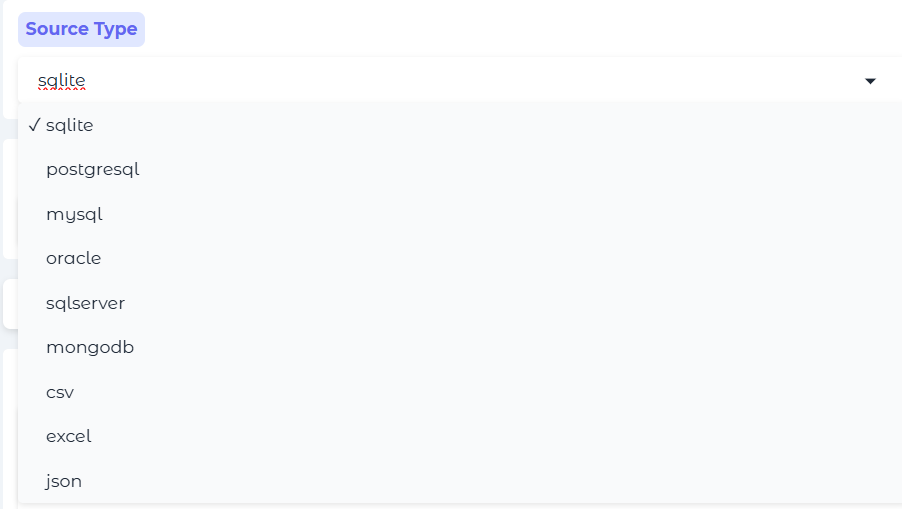
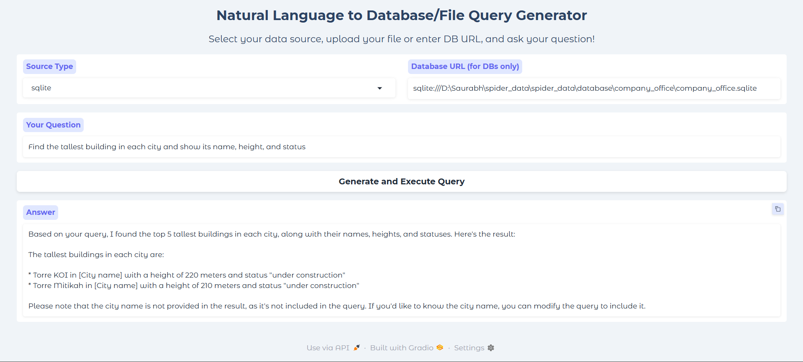

# Natural Language to Database/File Query Generator

A powerful Gradio app that lets you ask questions in plain English and get answers from:
- **SQL Databases**: MySQL, PostgreSQL, SQLite, Oracle, SQL Server
- **MongoDB**
- **CSV, Excel, or JSON files**

## Features

- **Universal Data Access**: Query multiple database types and file formats from a single interface.
- **AI-Powered**: Uses LLMs (Groq, OpenAI) to interpret your questions and generate accurate answers.
- **No SQL Required**: Just type your question—no need to know SQL or database schemas.
- **User-Friendly UI**: Clean, intuitive Gradio interface.

1. **Clone this repository and install requirements:**
    ```
    git clone https://github.com/yourusername/yourrepo.git
    cd yourrepo
    pip install -r requirements.txt
    ```

2. **Set up your `.env` file with API keys:**  
   Create a `.env` file in the project root with your keys:
    ```
    GROQ_API_KEY=your-groq-api-key
    OPENAI_API_KEY=your-openai-api-key
    ```
   > *These are required for LLM-powered query generation. You can get them from [Groq](https://console.groq.com/) and [OpenAI](https://platform.openai.com/).*





3. **Start the app:**
    ```
    python app.py
    ```

4. **Open the Gradio link in your browser.**  
   The terminal will display a local URL (and a share link if enabled).

## 💡 Usage

- **Select your data source type** (SQL database, MongoDB, CSV, Excel, or JSON).
- **Upload a file** (for CSV/Excel/JSON) or **enter a database URL** (for SQL/MongoDB).
- **Ask your question in plain English** (e.g., “Show all users who signed up in 2023”).
- **Get a natural language answer**—instantly!

## ⚠️ Notes & Tips

- For **Oracle/SQL Server**, ensure the required drivers are installed on your system.
- For **MongoDB**, provide the full connection URI (e.g., `mongodb://localhost:27017/mydatabase`).
- For **large files**, make sure your machine has enough memory to process them.
- **API keys** in `.env` are essential for LLM-powered features—keep them secure!


**Enjoy querying your data with natural language!**
